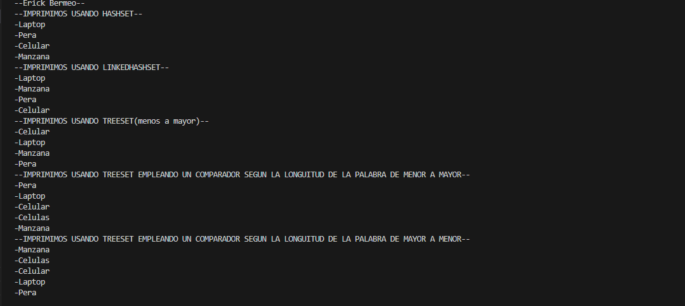

# Práctica Set y HashSet

## 📌 Información General

- **Título:** Práctica Uso de set y HasSet
- **Asignatura:** Estructura de Datos
- **Carrera:** Computación
- **Estudiante:** Erick Bermeo
- **Fecha:** 01/07/2025
- **Profesor:** Ing. Pablo Torres

---

## 🛠️ Descripción


---

## 🚀 Ejecución

Para ejecutar el proyecto:

1. Compila el código:
    ```bash
    javac App.java
    ```
2. Ejecuta la aplicación:
    ```bash
    java App
    ```

---

## 🧑‍💻 Ejemplo de Salida

```plaintext
--Erick Bermeo--
--IMPRIMIMOS USANDO HASHSET--
-Laptop
-Pera
-Celular
-Manzana
--IMPRIMIMOS USANDO LINKEDHASHSET--
-Laptop
-Manzana
-Pera
-Celular
--IMPRIMIMOS USANDO TREESET(menos a mayor)--
-Celular
-Laptop
-Manzana
-Pera
--IMPRIMIMOS USANDO TREESET EMPLEANDO UN COMPARADOR SEGUN LA LONGUITUD DE LA PALABRA DE MENOR A MAYOR--
-Pera
-Laptop
-Celular
-Celulas
-Manzana
--IMPRIMIMOS USANDO TREESET EMPLEANDO UN COMPARADOR SEGUN LA LONGUITUD DE LA PALABRA DE MAYOR A MENOR--
-Manzana
-Celulas
-Celular
-Laptop
-Pera
```
## 🖼️ Imagen

---